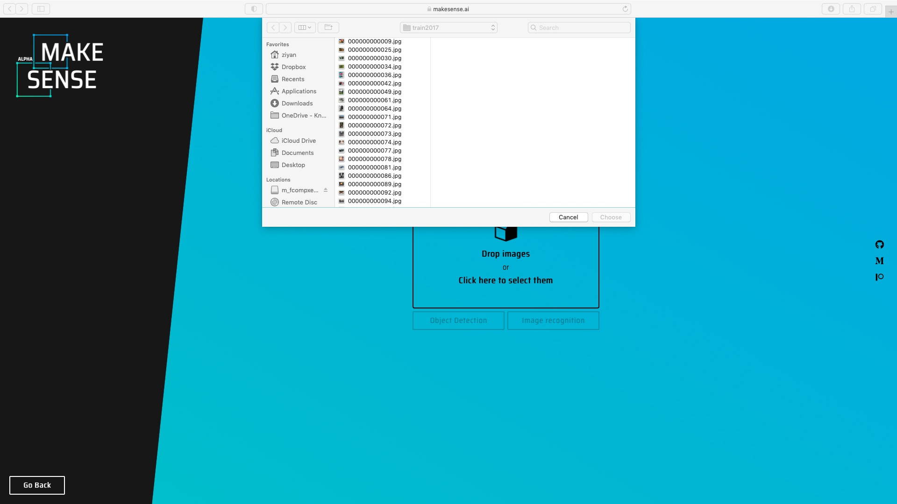
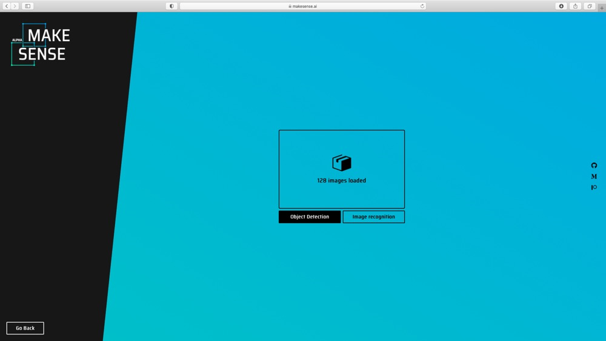
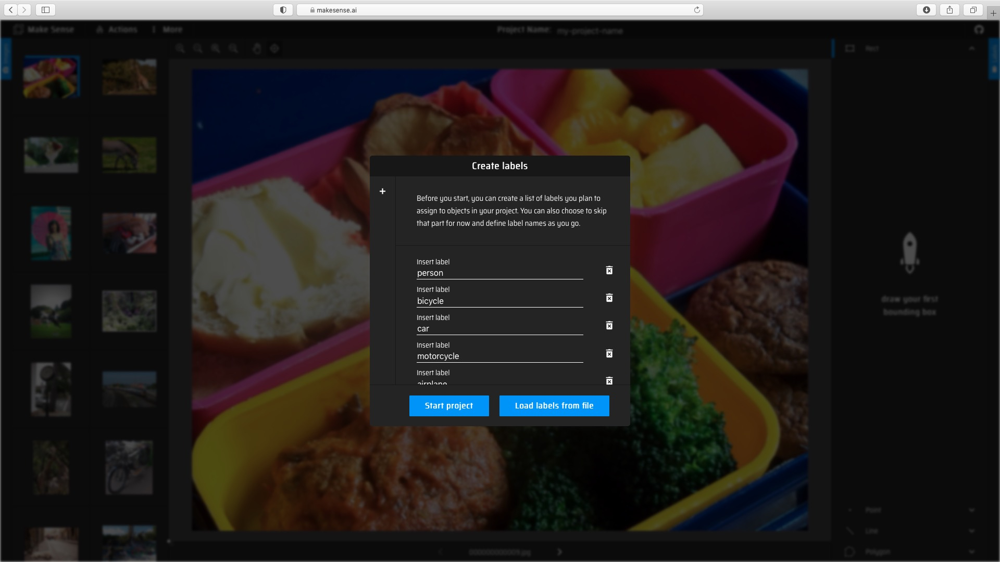
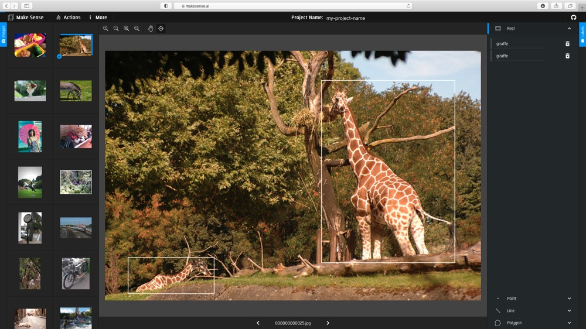
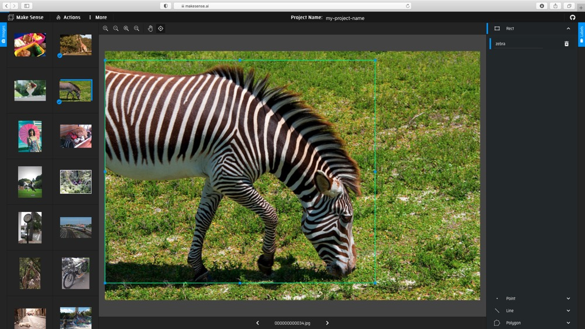
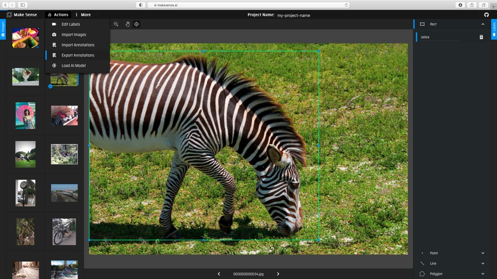
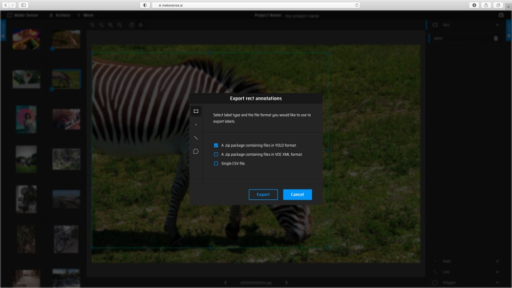
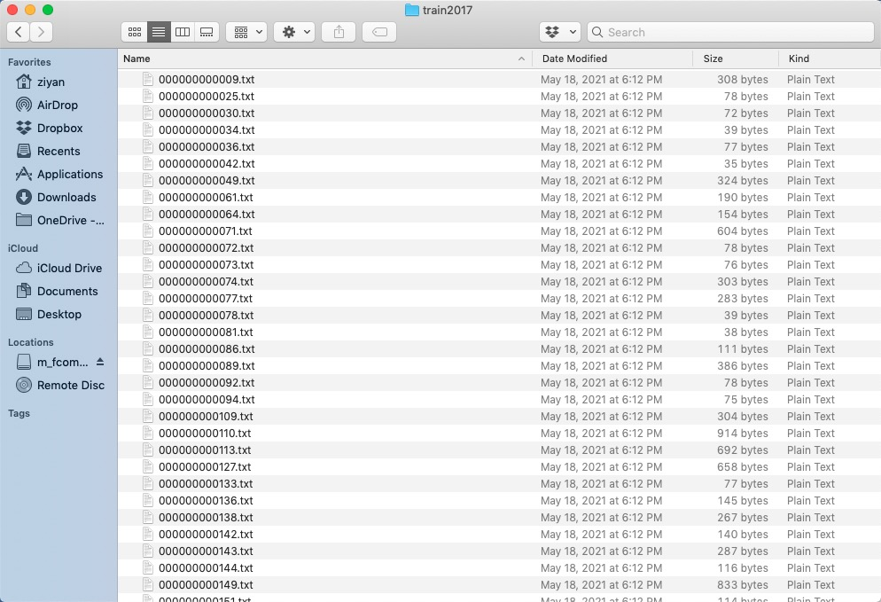
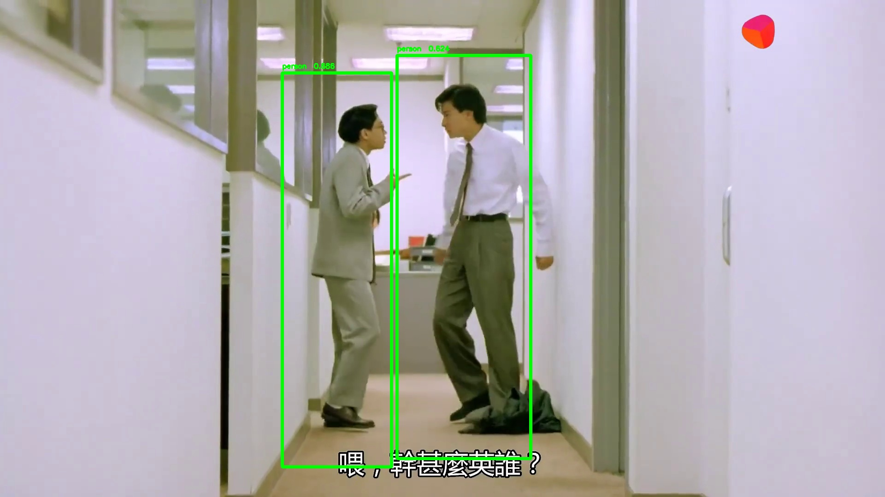

<h1 align="center">  Object Detection </h1>

The tutorial explores the basis of object detection task. In this document, we will go through a concrete example of how to train an image detection model via our AI training platform. The COCO128 dataset is provided.

Object detection is a computer technology related to computer vision and image processing that deals with detecting instances of semantic objects of a certain class (such as humans, buildings, or cars) in digital images and videos. Specifically, object detection algorithm predicts a bounding box with a category label for each instance of interest in an image. Our AI training platform provides the training script to train a FCOS model for object detection task. 

# Prerequisites
Firstly, we have to install the libraries. Python 3.6 or above is required. For other libraries, you can check the `requirements.txt` file. Installing these packages is simple. You can install them by running:
```
$ pip install -U pip
$ pip install -r requirements.txt
$ python setup.py build_ext --inplace
```

# Dataset & Preparation
Next, we need a dataset for the training model. For this tutorial, we use COCO128 dataset.

## Custom Datasets

Let's go through a toy example for preparing a custom dataset. Please note that it is for pedagogical use only. The data preparation for FCOS is similar to preparation for YOLOv5. The images are stored under the `yolov5/coco128` folder. We used [makesense.ai](https://www.makesense.ai) to annotate the images. 

(1) Upload images to [makesense.ai](https://www.makesense.ai) and select Object Detection option.  
<div align="center">
  
</div>

(2) Create labels, and then draw the bounding boxes and choose labels for each image.  
<div align="center">
    
</div>

(3) Export the annotations with YOLO format.
<div align="center">
  
</div>

(4) Eventually, you should get *.txt file for each image. (if no objects in image, no *.txt file is created)
<div align="center">
 
</div>

## Directory Organization
The COCO128 datasets are expected to have the following structure. 

```shell
- coco128
    
    -- images
        --- train2017
            ---- img001.jpg
            ---- img002.jpg
            ---- ...
        --- val
            ---- img003.jpg
            ---- ...
        
    -- labels2017
        --- train
            ---- img001.txt
            ---- img002.txt
            ---- ...
        --- val
            ---- img003.txt
            ---- ...
```
## dataset.yaml
You need to prepare the yaml file and save it under `./data/`. The yaml file for this coco128 dataset is expected to have the following format:
```shell
train: ../yolov5/coco128/images/train2017  # 128 images
val: ../yolov5/coco128/images/train2017  # 128 images

nc: 80

# class names
names: ['person', 'bicycle', 'car', 'motorcycle', 'airplane', 'bus', 'train', 'truck', 'boat', 'traffic light',
        'fire hydrant', 'stop sign', 'parking meter', 'bench', 'bird', 'cat', 'dog', 'horse', 'sheep', 'cow',
        'elephant', 'bear', 'zebra', 'giraffe', 'backpack', 'umbrella', 'handbag', 'tie', 'suitcase', 'frisbee',
        'skis', 'snowboard', 'sports ball', 'kite', 'baseball bat', 'baseball glove', 'skateboard', 'surfboard',
        'tennis racket', 'bottle', 'wine glass', 'cup', 'fork', 'knife', 'spoon', 'bowl', 'banana', 'apple',
        'sandwich', 'orange', 'broccoli', 'carrot', 'hot dog', 'pizza', 'donut', 'cake', 'chair', 'couch',
        'potted plant', 'bed', 'dining table', 'toilet', 'tv', 'laptop', 'mouse', 'remote', 'keyboard', 'cell phone',
        'microwave', 'oven', 'toaster', 'sink', 'refrigerator', 'book', 'clock', 'vase', 'scissors', 'teddy bear',
        'hair drier', 'toothbrush']
```

# Train 
Let's look at how to train or finetune a model. There are several options and arguments to choose. We provided four types of backbone models with three kinds of input size and two types of FPN layers. You can find the FPS results of these models evaluated on 520 and 720 in the Models section. 

let's finetune a pretrained model on COCO128 custom dataset (located under `yolov5` folder). The data yaml file is also prepared under `data` folder as `coco128.yaml`.

The pretrained model we used here is the model with backbone Darknet53s, pan FPN type, trained on COCO dataset. We download the pretrained model from [Model_Zoo](https://github.com/kneron/Model_Zoo/tree/main/detection/fcos). Since COCO128 is small, we choose to freeze the pretrained model backbone. Execute commands:
```shell
wget https://raw.githubusercontent.com/kneron/Model_Zoo/main/detection/fcos/coco_yolov5_pan_3_11_1.9920_0.4832.h5
```

```shell
python train.py --backbone darknet53s --fpn pan --snapshot coco_yolov5_pan_3_11_1.9920_0.4832.h5 --batch-size 4 --gpu 0 --steps 5 --epochs 2 --freeze-backbone --snapshot-path snapshots/exp --data data/coco128.yaml 
```

The following training messages will be printed:
```shell
...

{'data': 'data/coco128.yaml', 'snapshot': 'coco_yolov5_pan_3_11_1.9920_0.4832.h5', 'backbone': 'darknet53s', 'fpn': 'pan', 'reg_func': 'linear', 'stage': 3, 'head_type': 'simple', 'centerness_pos': 'reg', 'batch_size': 4, 'gpu': '0', 'epochs': 2, 'steps': 5, 'lr': 0.0001, 'snapshot_path': 'snapshots/exp', 'freeze_backbone': True, 'input_size': 512, 'compute_val_loss': False}

...

Epoch 1/2
5/5 [==============================] - 15s 3s/step - loss: 2.9818 - regression_loss: 0.6292 - classification_loss: 1.1851 - centerness_loss: 0.6721
100% (126 of 126) |##################################################################################################################################################| Elapsed Time: 0:00:10 Time:  0:00:10
100% (126 of 126) |##################################################################################################################################################| Elapsed Time: 0:00:00 Time:  0:00:00
100% (80 of 80) |####################################################################################################################################################| Elapsed Time: 0:00:00 Time:  0:00:00
254 instances of class person with average precision: 0.6755
6 instances of class bicycle with average precision: 0.2104
46 instances of class car with average precision: 0.1860
5 instances of class motorcycle with average precision: 1.0000
6 instances of class airplane with average precision: 0.8333
7 instances of class bus with average precision: 0.6078
3 instances of class train with average precision: 1.0000
12 instances of class truck with average precision: 0.1598
6 instances of class boat with average precision: 0.3508
14 instances of class traffic light with average precision: 0.2176
0 instances of class fire hydrant with average precision: 0.0000
2 instances of class stop sign with average precision: 0.8333
0 instances of class parking meter with average precision: 0.0000
9 instances of class bench with average precision: 0.3277
16 instances of class bird with average precision: 0.7248
4 instances of class cat with average precision: 0.9500
9 instances of class dog with average precision: 0.5672
2 instances of class horse with average precision: 1.0000
0 instances of class sheep with average precision: 0.0000
0 instances of class cow with average precision: 0.0000
17 instances of class elephant with average precision: 0.8676
1 instances of class bear with average precision: 1.0000
4 instances of class zebra with average precision: 1.0000
9 instances of class giraffe with average precision: 0.8176
6 instances of class backpack with average precision: 0.4042
18 instances of class umbrella with average precision: 0.6162
19 instances of class handbag with average precision: 0.0699
7 instances of class tie with average precision: 0.4048
4 instances of class suitcase with average precision: 0.7750
5 instances of class frisbee with average precision: 0.7600
1 instances of class skis with average precision: 1.0000
7 instances of class snowboard with average precision: 0.8101
6 instances of class sports ball with average precision: 0.1667
10 instances of class kite with average precision: 0.0400
4 instances of class baseball bat with average precision: 0.1750
7 instances of class baseball glove with average precision: 0.0714
5 instances of class skateboard with average precision: 0.4107
0 instances of class surfboard with average precision: 0.0000
7 instances of class tennis racket with average precision: 0.3263
18 instances of class bottle with average precision: 0.1790
16 instances of class wine glass with average precision: 0.5150
36 instances of class cup with average precision: 0.3527
6 instances of class fork with average precision: 0.1807
16 instances of class knife with average precision: 0.4001
22 instances of class spoon with average precision: 0.2750
28 instances of class bowl with average precision: 0.5735
1 instances of class banana with average precision: 0.1111
0 instances of class apple with average precision: 0.0000
2 instances of class sandwich with average precision: 0.3333
4 instances of class orange with average precision: 0.4333
11 instances of class broccoli with average precision: 0.1912
24 instances of class carrot with average precision: 0.5854
2 instances of class hot dog with average precision: 0.7500
5 instances of class pizza with average precision: 0.9250
14 instances of class donut with average precision: 0.7913
4 instances of class cake with average precision: 0.9500
35 instances of class chair with average precision: 0.4005
6 instances of class couch with average precision: 0.4900
14 instances of class potted plant with average precision: 0.3834
3 instances of class bed with average precision: 0.7556
13 instances of class dining table with average precision: 0.4553
2 instances of class toilet with average precision: 0.5238
2 instances of class tv with average precision: 0.6667
3 instances of class laptop with average precision: 0.5556
2 instances of class mouse with average precision: 0.0000
8 instances of class remote with average precision: 0.5312
0 instances of class keyboard with average precision: 0.0000
8 instances of class cell phone with average precision: 0.0893
3 instances of class microwave with average precision: 0.8333
5 instances of class oven with average precision: 0.2833
0 instances of class toaster with average precision: 0.0000
6 instances of class sink with average precision: 0.1250
5 instances of class refrigerator with average precision: 0.8500
29 instances of class book with average precision: 0.1549
9 instances of class clock with average precision: 0.7222
2 instances of class vase with average precision: 0.4000
1 instances of class scissors with average precision: 0.1429
21 instances of class teddy bear with average precision: 0.5500
0 instances of class hair drier with average precision: 0.0000
5 instances of class toothbrush with average precision: 0.4310
mAP: 0.5106

Epoch 00001: mAP improved from -inf to 0.51057, saving model to snapshots/exp/csv_darknet53s_pan_3_01.h5

...

```

As we can see from the messages, the traininng losses and time are printed and the validation mAP were reported in each epoch.  The trained model will be saved to `snapshots/exp` folder. 

# Inference 
In this section, we will go through an example of using a trained network for inference. That is, we'll pass an image into the network and detect and classify the object in the image. We will use the function `inference.py` that takes an image and a model, then returns the detection information. The output format is a list of list, [[l,t,w,h,score,class_id], [l,t,w,h,score,class_id] ...]. We can also draw the bbox on the image if the save path is given. 

Let's run our network on the following image, a screenshot from a movie, with the following code:
```shell
python inference.py --snapshot snapshots/exp/csv_darknet53s_pan_3_01.h5 --score-thres 0.6 --gpu 0 --class-id-path utils/coco_id_class_map.json --img-path tutorial/demo/fcos_demo.jpg --save-path tutorial/demo/out.jpg

...

{'img_path': 'tutorial/demo/fcos_demo.jpg', 'class_id_path': 'utils/coco_id_class_map.json', 'gpu': 0, 'snapshot': '/mnt/models/Model_Zoo/Backbone/FCOS/coco_yolov5_pan_3_11_1.9920_0.4832.h5', 'input_shape': [416, 416], 'max_objects': 100, 'score_thres': 0.6, 'iou_thres': 0.5, 'nms': 1, 'save_path': 'tutorial/demo/out.jpg'}

...

[[612.0043802261353, 158.87532234191895, 237.44566440582275, 855.7113647460938, 0.685798168182373, 0.0], [861.6132688522339, 120.55203437805176, 290.30023097991943, 876.4039421081543, 0.624030590057373, 0.0]]

```
Here we choose a model trained on COCO dataset and provide our class id mapping file. The original image and processed image are shown below.   
<div align="center">
  
</div>

We also get the inference result saved in a json file located under the same folder as the input image, `./tutorial/demo/fcos_demo_preds.json`.

Note that the class id mapping file is either a json or a csv file. The choice of class id mapping file depends on the dataset on which model was training. If the model was trained on COCO, it is ok to use `./utils/coco_id_class_map.json`. If the model was train on custom dataset, we shall use the csv file which was created during the dataset preparation process. You may check `./utils/coco_id_class_map.json` or `./tutorial/class_id.csv` for the format. 

# Convert to ONNX

Pull the latest [ONNX converter](https://github.com/kneron/ONNX_Convertor/tree/master/keras-onnx) from github. You may read the latest document from Github for converting ONNX model. Execute commands in the folder `ONNX_Convertor/keras-onnx`:
(reference: https://github.com/kneron/ONNX_Convertor/tree/master/keras-onnx)
```shell
!git clone https://github.com/kneron/ONNX_Convertor.git
```

```shell
python ONNX_Convertor/keras-onnx/generate_onnx.py -o snapshots/exp/csv_darknet53s_pan_3_01_converted.onnx snapshots/exp/csv_darknet53s_pan_3_01.h5
```

The converted onnx model is `snapshots/exp/csv_darknet53s_pan_3_01_converted.onnx`.

# Evaluation

## Evaluation on COCO128
In this section, we will go through an example of evaluating a trained network on a dataset. Here, we will evaluate a pretrained model on MS COCO128 dataset. The `utils/eval.py` will report the mAP score for the model evaluated on the testing dataset.

```shell
python utils/eval.py --snapshot snapshots/exp/csv_darknet53s_pan_3_01.h5 --gpu 1 --conf-thres 0.15 --save-path bboxes_result.json --data data/coco128.yaml

{'data': 'data/coco128.yaml', 'gpu': 1, 'snapshot': 'snapshots/exp/csv_darknet53s_pan_3_01.h5', 'input_shape': [512, 512], 'save_path': 'bboxes_result.json', 'detections_path': None, 'conf_thres': 0.15, 'iou_thres': 0.35}

100% (126 of 126) |##################################################################################################################################################| Elapsed Time: 0:00:10 Time:  0:00:10
100% (126 of 126) |##################################################################################################################################################| Elapsed Time: 0:00:00 Time:  0:00:00
100% (80 of 80) |####################################################################################################################################################| Elapsed Time: 0:00:00 Time:  0:00:00
254 instances of class person with average precision: 0.7489
6 instances of class bicycle with average precision: 0.1667
46 instances of class car with average precision: 0.2072
5 instances of class motorcycle with average precision: 0.6833
6 instances of class airplane with average precision: 0.9048
7 instances of class bus with average precision: 0.6321
3 instances of class train with average precision: 0.6667
12 instances of class truck with average precision: 0.0278
6 instances of class boat with average precision: 0.4184
14 instances of class traffic light with average precision: 0.2823
0 instances of class fire hydrant with average precision: 0.0000
2 instances of class stop sign with average precision: 0.8333
0 instances of class parking meter with average precision: 0.0000
9 instances of class bench with average precision: 0.2108
16 instances of class bird with average precision: 0.5609
4 instances of class cat with average precision: 0.5000
9 instances of class dog with average precision: 0.3657
2 instances of class horse with average precision: 0.5000
0 instances of class sheep with average precision: 0.0000
0 instances of class cow with average precision: 0.0000
17 instances of class elephant with average precision: 0.9606
1 instances of class bear with average precision: 1.0000
4 instances of class zebra with average precision: 1.0000
9 instances of class giraffe with average precision: 0.9181
6 instances of class backpack with average precision: 0.0333
18 instances of class umbrella with average precision: 0.7202
19 instances of class handbag with average precision: 0.1372
7 instances of class tie with average precision: 0.6458
4 instances of class suitcase with average precision: 0.6929
5 instances of class frisbee with average precision: 0.8000
1 instances of class skis with average precision: 1.0000
7 instances of class snowboard with average precision: 0.6264
6 instances of class sports ball with average precision: 0.1790
10 instances of class kite with average precision: 0.2250
4 instances of class baseball bat with average precision: 0.4076
7 instances of class baseball glove with average precision: 0.2857
5 instances of class skateboard with average precision: 0.4200
0 instances of class surfboard with average precision: 0.0000
7 instances of class tennis racket with average precision: 0.4389
18 instances of class bottle with average precision: 0.1204
16 instances of class wine glass with average precision: 0.6377
36 instances of class cup with average precision: 0.4123
6 instances of class fork with average precision: 0.0972
16 instances of class knife with average precision: 0.4170
22 instances of class spoon with average precision: 0.4226
28 instances of class bowl with average precision: 0.5763
1 instances of class banana with average precision: 0.0909
0 instances of class apple with average precision: 0.0000
2 instances of class sandwich with average precision: 0.0000
4 instances of class orange with average precision: 0.4688
11 instances of class broccoli with average precision: 0.2327
24 instances of class carrot with average precision: 0.6571
2 instances of class hot dog with average precision: 0.0000
5 instances of class pizza with average precision: 0.8000
14 instances of class donut with average precision: 0.7384
4 instances of class cake with average precision: 0.6250
35 instances of class chair with average precision: 0.4219
6 instances of class couch with average precision: 0.1056
14 instances of class potted plant with average precision: 0.4855
3 instances of class bed with average precision: 0.6667
13 instances of class dining table with average precision: 0.5797
2 instances of class toilet with average precision: 0.6667
2 instances of class tv with average precision: 0.6667
3 instances of class laptop with average precision: 0.3333
2 instances of class mouse with average precision: 0.0714
8 instances of class remote with average precision: 0.4332
0 instances of class keyboard with average precision: 0.0000
8 instances of class cell phone with average precision: 0.0774
3 instances of class microwave with average precision: 0.8333
5 instances of class oven with average precision: 0.4594
0 instances of class toaster with average precision: 0.0000
6 instances of class sink with average precision: 0.0000
5 instances of class refrigerator with average precision: 0.8000
29 instances of class book with average precision: 0.1919
9 instances of class clock with average precision: 0.8765
2 instances of class vase with average precision: 0.3333
1 instances of class scissors with average precision: 0.0000
21 instances of class teddy bear with average precision: 0.6512
0 instances of class hair drier with average precision: 0.0000
5 instances of class toothbrush with average precision: 0.4462
mAP: 0.4732

```

## End-to-End Evaluation
Let's look at an example of end-to-end inference on COCO128. First, we need an initial parameter yaml file for the inference runner:
```bash
checkpoint: snapshots/exp/csv_darknet53s_pan_3_01.h5 # trained model

input_h: 512
input_w: 512
max_objects: 100
score_thres: 0.6
iou_thres: 0.5
```
This initial parameter yaml file is saved as `utils/init_params.yaml`. Then, execute the following command under `fcos` directory:
```shell
 python inference_e2e.py --img-path ../yolov5/coco128/images/train2017/ --params utils/init_params.yaml --save-path coco128_preds.json
```
The predictions are stored in `coco128_preds.json`.
