<h1 align="center">  Object Detection with YOLOv5 </h1>

This tutorial will go through a concrete example of how to train a YOLOv5 object detection model via our AI training platform. The coco128 dataset is provided.


# Prerequisites
First of all, we have to install the libraries. Python>=3.8 is required. For other libraries, you can check the `requirements.txt` file. Installing these packages is simple. You can install them by running:

```bash
$ pip install -U pip
$ pip install -r requirements.txt
```

# Dataset & Preparation

Next, we need a dataset for the training model. For this tutorial, we use COCO128 dataset.

## Annotations Format
After using a tool like [CVAT](https://github.com/openvinotoolkit/cvat), [makesense.ai](https://www.makesense.ai) or [Labelbox](https://labelbox.com) to label your images, export your labels to YOLO format, with one `*.txt` file per image (if no objects in image, no `*.txt` file is required). The `*.txt` file specifications are:

- One row per object
- Each row is `class x_center y_center width height` format.
- Box coordinates must be in normalized xywh format (from 0 - 1). If your boxes are in pixels, divide `x_center` and `width` by image `width`, and `y_center` and `height` by image height.
- Class numbers are zero-indexed (start from 0).

Here, let's go through a toy example for preparing the annotation files via [makesense.ai](https://www.makesense.ai).

(1) Upload images to [makesense.ai](https://www.makesense.ai) and select Object Detection option.  

<div align="center">
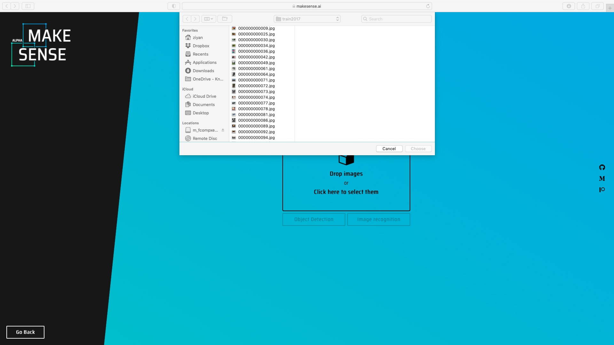 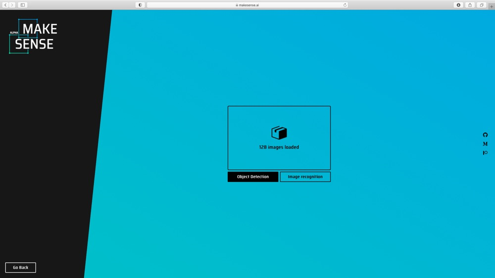 
</div>

(2) Create labels, and then draw the bounding boxes and choose labels for each image.  

<div align="center">
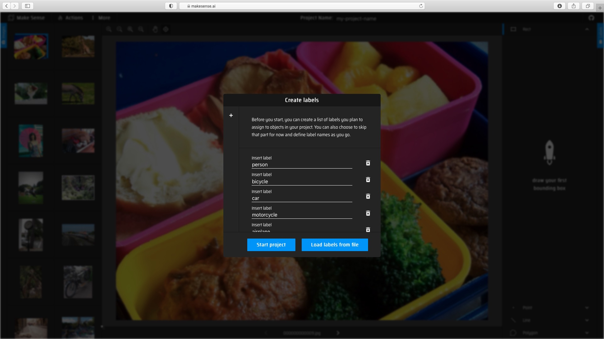 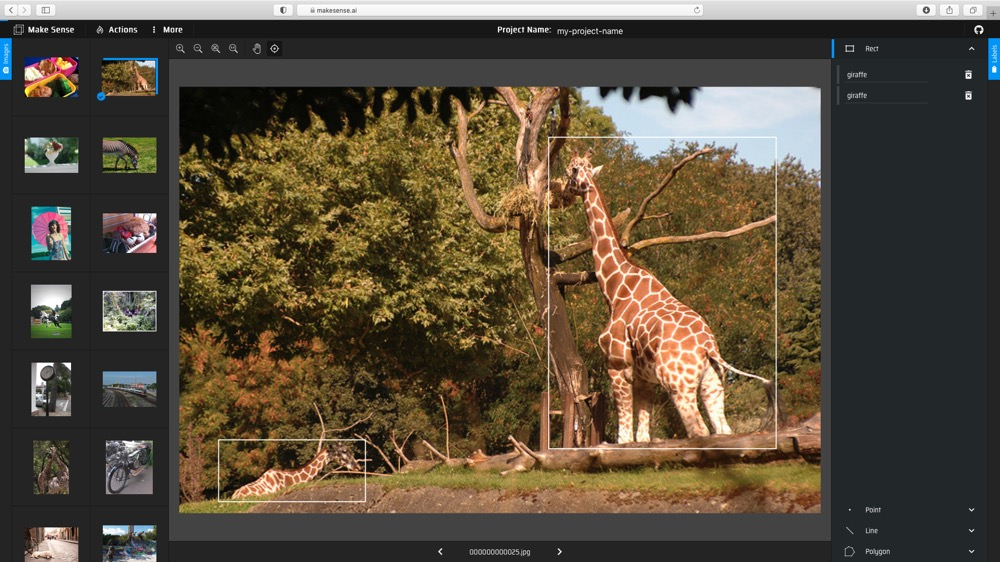  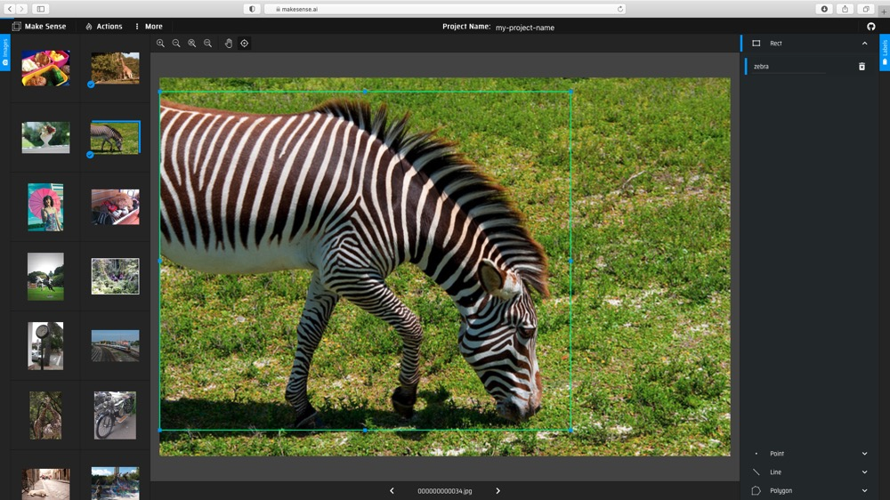 
</div>

(3) Export the annotations with YOLO format.
<div align="center">
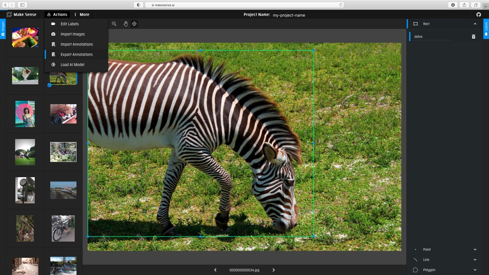 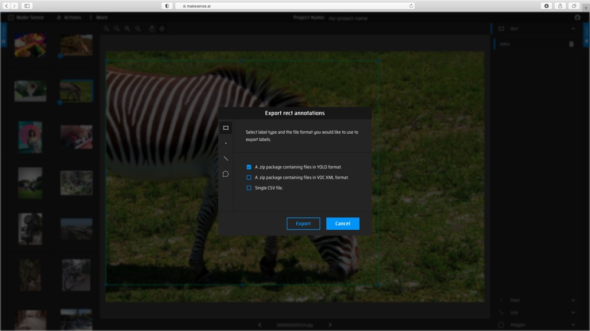 
</div>

(4) Eventually, you should get `*.txt` file for each image. (if no objects in image, no `*.txt` file is created)
<div align="center">
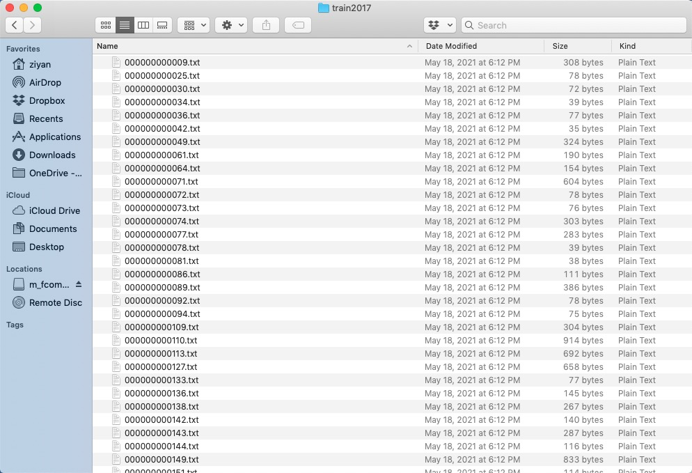  
</div>

##  Directory Organization
Your own datasets are expected to have the following structure. We assume `/coco128` is next to the `/yolov5` directory. YOLOv5 locates labels automatically for each image by replacing the last instance of `/images/` in each image path with `/labels/`.

<div align="center">
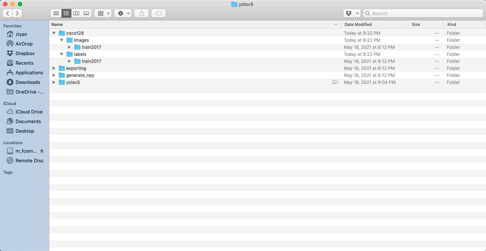  
</div>

##  dataset.yaml

The yaml file for COCO dataset has been prepared in `./data/coco.yaml`. For custom dataset, you need to prepare the yaml file and save it under `./data/`. The yaml file is expected to have the following format:

<div align="center">
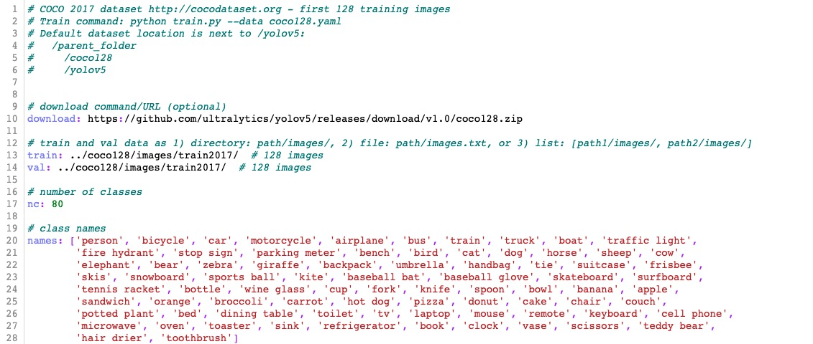  
</div>


# Train 
Let's look at how to train or finetune a model. There are several options and arguments to choose. We provided two types of backbone models, one for 520 (without upsampling) and one for 720  (with upsampling). 

For training on custom dataset, let's use the COCO 128 dataset. Following the instructions in the dataset preparation section, we put the data folder `/coco128` next to the `/yolov5` directory and prepare `coco128.yaml` saved under the folder `/yolov5/data/`. We download the pretrained model from [Model_Zoo](https://github.com/kneron/Model_Zoo/tree/main/detection/yolov5/yolov5s-noupsample). Suppose we would like to finetune a pretrained model for 520 and just run 2 epochs. Execute commands in the folder `yolov5`:

```shell
!wget https://raw.githubusercontent.com/kneron/Model_Zoo/main/detection/yolov5/yolov5s-noupsample/best.pt
```

```shell
CUDA_VISIBLE_DEVICES='0' python train.py --data coco128.yaml --cfg yolov5s-noupsample.yaml --weights 'best.pt' --batch-size 2 --epoch 2
```
<div align="center">
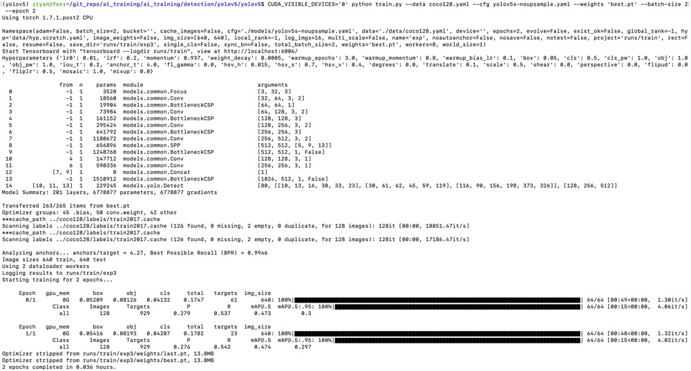   
</div>

We get the trained model weights in `./runs/train/exp/weights/best.pt`.

Note that video uses input (640w x 352h) to run faster. Coco has high or flat wide images, so it is better to use input (640w x 640h) 
 
## Generating .npy for different model input
We can generating `.npy` for different model input by using `yolov5_generate_npy.py`. Execute commands in the folder `generate_npy`:
```shell
python yolov5_generate_npy.py
```

<div align="center">
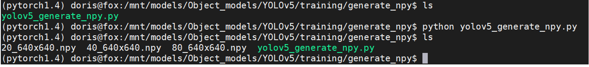  
</div>

We could get `*.npy`.


# Configure the paths yaml file
You are expected to create a yaml file which stores all the paths related to the trained models. You can check and modify the `pretrained_paths_520.yaml` and `pretrained_paths_720.yaml` under `/yolov5/data/`. Here is the config for our model trained on COCO128 `model_paths_520_coco128.yaml`:

```bash
grid_dir: ../generate_npy/
grid20_path: ../generate_npy/20_640x640.npy
grid40_path: ../generate_npy/40_640x640.npy
grid80_path: ../generate_npy/80_640x640.npy

yolov5_dir: ./
path: ./runs/train/exp/weights/best.pt
yaml_path: ./models/yolov5s-noupsample.yaml
pt_path: ./yolov5s-noupsample-coco128.pt   # pytorch 1.4
onnx_export_file: ./yolov5s-noupsample-coco128.onnx

input_w: 640
input_h: 640
# number of classes
nc: 80
# class names
names: ['person', 'bicycle', 'car', 'motorcycle', 'airplane', 'bus', 'train', 'truck', 'boat', 'traffic light',
        'fire hydrant', 'stop sign', 'parking meter', 'bench', 'bird', 'cat', 'dog', 'horse', 'sheep', 'cow',
        'elephant', 'bear', 'zebra', 'giraffe', 'backpack', 'umbrella', 'handbag', 'tie', 'suitcase', 'frisbee',
        'skis', 'snowboard', 'sports ball', 'kite', 'baseball bat', 'baseball glove', 'skateboard', 'surfboard',
        'tennis racket', 'bottle', 'wine glass', 'cup', 'fork', 'knife', 'spoon', 'bowl', 'banana', 'apple',
        'sandwich', 'orange', 'broccoli', 'carrot', 'hot dog', 'pizza', 'donut', 'cake', 'chair', 'couch',
        'potted plant', 'bed', 'dining table', 'toilet', 'tv', 'laptop', 'mouse', 'remote', 'keyboard', 'cell phone',
        'microwave', 'oven', 'toaster', 'sink', 'refrigerator', 'book', 'clock', 'vase', 'scissors', 'teddy bear',
        'hair drier', 'toothbrush']
```

# Save and Convert to ONNX
For now, we have trained the YOLOv5 model. This section will walk you through how to save the trained model for onnx converter supported format and convert to ONNX. 

## Exporting onnx model in the pytorch1.7 environment
We can convert the model to onnx by using `yolov5_export.py`. Execute commands in the folder `yolov5`:
```shell
python ../exporting/yolov5_export.py --data ../yolov5/data/model_paths_520_coco128.yaml
```

<div align="center">
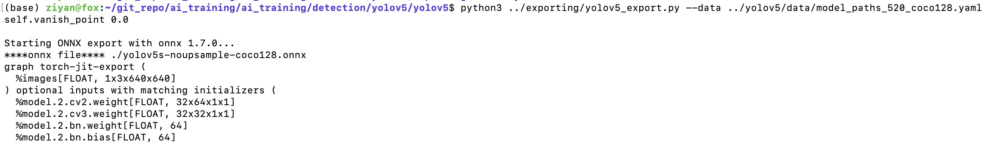  
</div>

We could get `yolov5s-noupsample-coco128.onnx` under the folder `yolov5`.


## Converting onnx by tool chain
Pull the latest [ONNX converter](https://github.com/kneron/ONNX_Convertor/tree/master/optimizer_scripts) from github. Execute commands in the folder `ONNX_Convertor/optimizer_scripts`:
(reference: https://github.com/kneron/ONNX_Convertor/tree/master/optimizer_scripts)

```shell
python -m onnxsim yolov5s-noupsample-coco128.onnx yolov5s-noupsample-coco128.onnx

git clone https://github.com/kneron/ONNX_Convertor.git

python ONNX_Convertor/optimizer_scripts/pytorch2onnx.py yolov5s-noupsample-coco128.onnx yolov5s-noupsample-coco128_convert.onnx
```

We could get `yolov5s-noupsample-coco128_convert.onnx`.


# Inference

In this section, we will go through an example of using a trained network for inference. That is, we'll pass an image into the network and detect and classify the object in the image. Before model inference, we assume that the model has been converted to onnx model as in the previous section. We will use the function `inference.py` that takes an image and a model, then returns the detection information. The output format is a list of list, [[l,t,w,h,score,class_id], [l,t,w,h,score,class_id] ...]. We can also draw the bbox on the image if the save path is given. You could find preprocessing and postprocessing processes under the folder `exporting/yolov5/`.

In this tutorial, we choose to run our yolov5 model on 520. First, we would like to save the model path information in a yaml file, called `pretrained_paths_520.yaml`, under the folder `data`. Here, we could reuse the yaml file which was created when we convert PyTorch model to ONNX. 

For model inference on a single image, execute commands in the folder `yolov5` and the outputs are as following:

```shell
python inference.py --data data/model_paths_520_coco128.yaml --conf_thres 0.6 --img-path tutorial/demo/yolo_demo.jpg --save-path tutorial/demo/out.jpg

[[934.0, 183.0, 284.0, 751.0, 0.8913591504096985, 0.0], [670.0, 225.0, 224.0, 696.0, 0.8750525712966919, 0.0]]

```

Here we choose a model trained on COCO128 dataset and class labels and pretrained model paths are defined in the yaml file `data/model_paths_520_coco128.yaml`. The original image and processed image are shown below.

<div align="center">
  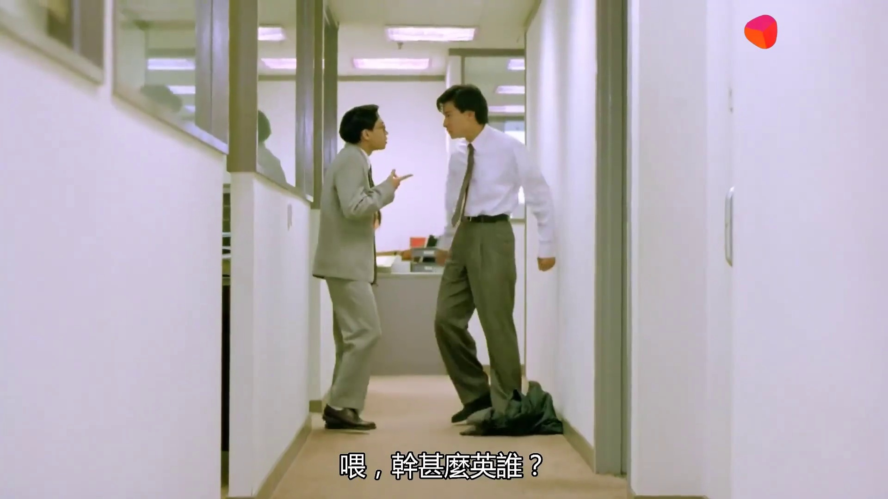  
</div>

Note that if the model was train on custom dataset, you have to modify the yaml file. 

If you would like to use ONNX model for inference, you need to add `--onnx` arguments when you execute `inference.py`. 

# Evaluation 
In this section, we will evaluate our trained model on COCO128 dataset. Execute commands in the folder `yolov5` and the outputs are as following:

```shell
python test.py --weights runs/train/exp/weights/best.pt --verbose

Namespace(augment=False, batch_size=32, conf_thres=0.001, data='data/coco128.yaml', device='cpu', exist_ok=False, img_size=640, iou_thres=0.65, name='exp', project='runs/test', save_conf=False, save_json=False, save_txt=False, single_cls=False, task='val', verbose=True, weights=['runs/train/exp/weights/best.pt'])
Using torch 1.7.0 CPU

Fusing layers... 
Model Summary: 164 layers, 6772285 parameters, 0 gradients
***cache_path ../coco128/labels/train2017.cache
Scanning labels ../coco128/labels/train2017.cache (126 found, 0 missing, 2 empty, 0 duplicate, for 128 images): 128it [00:00, 9335.42it/s]
               Class      Images     Targets           P           R      mAP@.5  mAP@.5:.95: 100%|███████████████████████████████████████████████████████████████████████████| 4/4 [01:07<00:00, 16.95s/it]
                 all         128         929       0.284       0.562       0.492       0.307
              person         128         254        0.37       0.764       0.718       0.437
             bicycle         128           6       0.373         0.5        0.36       0.217
                 car         128          46       0.286       0.326       0.275       0.145
          motorcycle         128           5       0.433           1       0.962       0.701
            airplane         128           6       0.559       0.833       0.824       0.539
                 bus         128           7       0.412       0.714         0.7       0.588
               train         128           3       0.209       0.667       0.552       0.269
               truck         128          12       0.452       0.412       0.376       0.135
                boat         128           6       0.109       0.333       0.229      0.0458
       traffic light         128          14      0.0488      0.0714       0.096      0.0599
           stop sign         128           2       0.636           1       0.995       0.747
               bench         128           9       0.152       0.222       0.171      0.0814
                bird         128          16       0.459       0.562       0.538        0.28
                 cat         128           4       0.353           1       0.725       0.548
                 dog         128           9       0.532       0.667       0.632       0.422
               horse         128           2        0.31           1       0.995       0.473
            elephant         128          17       0.666       0.824        0.84       0.606
                bear         128           1       0.323           1       0.995       0.896
               zebra         128           4       0.721           1       0.995       0.921
             giraffe         128           9       0.459       0.889       0.928       0.551
            backpack         128           6       0.291       0.333       0.386       0.193
            umbrella         128          18       0.394         0.5       0.458       0.208
             handbag         128          19       0.101       0.105       0.112      0.0483
                 tie         128           7         0.3       0.714         0.6       0.355
            suitcase         128           4       0.672         0.5       0.697       0.193
             frisbee         128           5       0.315         0.8       0.665       0.416
                skis         128           1       0.103           1       0.498      0.0498
           snowboard         128           7       0.534       0.821       0.674        0.36
         sports ball         128           6       0.165         0.5       0.258       0.155
                kite         128          10       0.225         0.2       0.133      0.0334
        baseball bat         128           4       0.016       0.052       0.055      0.0275
      baseball glove         128           7      0.0989       0.286       0.292       0.146
          skateboard         128           5       0.323         0.4       0.376       0.259
       tennis racket         128           7       0.105       0.429       0.327       0.164
              bottle         128          18       0.202       0.611       0.372       0.214
          wine glass         128          16        0.22       0.438       0.397       0.252
                 cup         128          36       0.297       0.389       0.345       0.206
                fork         128           6      0.0841       0.167       0.177       0.135
               knife         128          16       0.301         0.5       0.408       0.143
               spoon         128          22       0.232       0.273        0.31        0.12
                bowl         128          28       0.393       0.714       0.591       0.393
              banana         128           1        0.13           1       0.332      0.0332
            sandwich         128           2       0.183       0.459       0.115       0.103
              orange         128           4       0.096        0.25       0.125      0.0856
            broccoli         128          11       0.107      0.0909       0.116      0.0998
              carrot         128          24       0.198       0.708       0.409       0.231
             hot dog         128           2       0.274           1       0.828       0.746
               pizza         128           5       0.588         0.6        0.66       0.473
               donut         128          14       0.249           1       0.858        0.66
                cake         128           4       0.388           1       0.788       0.547
               chair         128          35       0.174         0.6       0.331       0.156
               couch         128           6       0.367       0.667       0.678       0.403
        potted plant         128          14       0.249       0.571        0.49         0.3
                 bed         128           3       0.623       0.667       0.677       0.224
        dining table         128          13        0.26       0.538       0.449       0.289
              toilet         128           2      0.0943         0.5       0.497       0.397
                  tv         128           2       0.198           1       0.995       0.696
              laptop         128           3           0           0      0.0184      0.0111
               mouse         128           2           0           0           0           0
              remote         128           8       0.339         0.5       0.512        0.33
          cell phone         128           8      0.0833       0.125      0.0382      0.0208
           microwave         128           3       0.248           1       0.995       0.502
                oven         128           5       0.143         0.4       0.336       0.222
                sink         128           6       0.106       0.167      0.0876       0.078
        refrigerator         128           5        0.35         0.6       0.564       0.403
                book         128          29       0.143       0.138       0.139      0.0655
               clock         128           9       0.435       0.889       0.848       0.679
                vase         128           2      0.0816           1       0.995       0.846
            scissors         128           1           0           0      0.0524     0.00524
          teddy bear         128          21       0.495       0.514       0.522       0.249
          toothbrush         128           5         0.3         0.4        0.44       0.186
Speed: 243.3/124.9/368.3 ms inference/NMS/total per 640x640 image at batch-size 32
Results saved to runs/test/exp

```